## 前言

由于每次上传分数都要改一遍代理，来回切换感觉很烦，本人又有科学上网的需求，不妨改个路由分流直接上传，于是就有了这篇文章

该文章需要:

- 一台含有基于AOSP定制系统的设备

- 有一定沉淀的网络基础知识

- 有一定沉淀的计算机领域理论

## 原理

当客户端访问指定网站时，会向服务端发送指定的协议请求，并返回客户端结果。在客户端请求过程可以是直连请求，也可以是代理请求，目的都是让服务端为了返回结果，所以我们可以通过代理池指定某个域名请求是否通过代理。

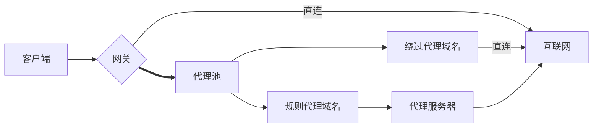

## 教程

### 下载 nekobox

地址: https://github.com/MatsuriDayo/NekoBoxForAndroid/releases/latest

选择后缀带有 `arm64-v8a.apk` 的, 安装即可

### 创建代理

这里使用 [bakapiano](https://github.com/bakapiano/) 的 [maimaidx-prober-proxy-updater](https://github.com/bakapiano/maimaidx-prober-proxy-updater) 项目提供的代理, 有条件可以自己搭建上传成绩的服务器

在 nekobox 中, 点击右上角, 添加服务器配置, 创建一个http代理

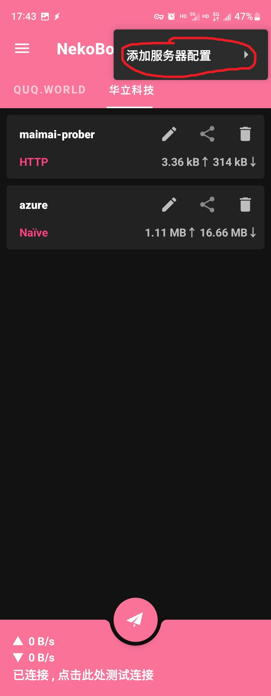

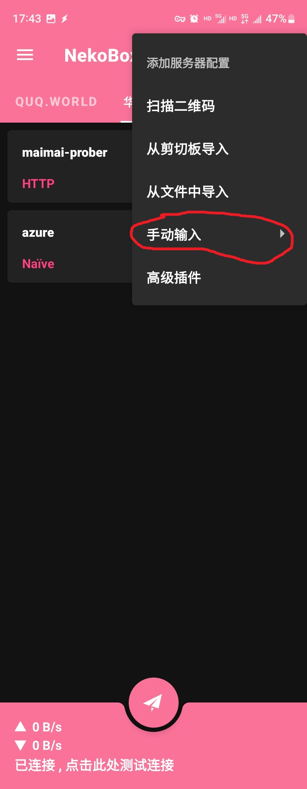

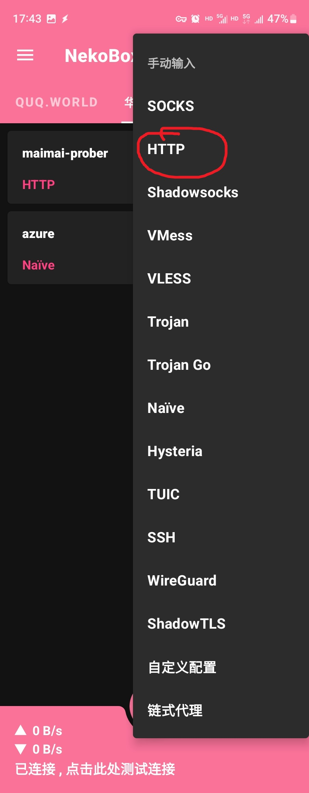

配置名称: 自己定义 (可以不取, 会显示`proxy.bakapiano.com:2560`, 教程演示的是`maimai-prober`)

地址: `proxy.bakapiano.com`

端口: `2560`

其他默认即可

然后点击刚刚创建的代理即可

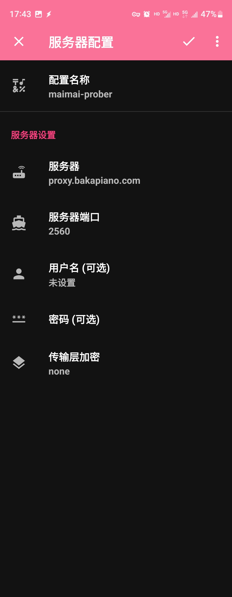

### 创建路由

点击左上角 - 路由

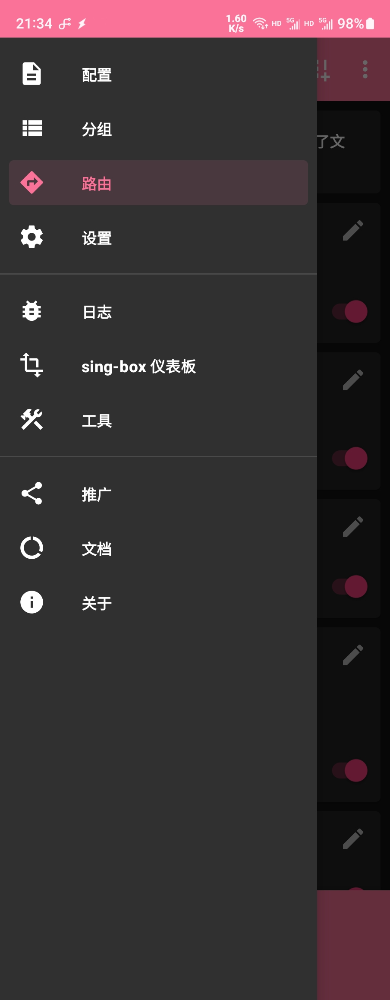

创建一个路由, 路由名字自己定义 (这里我定义为华立科技), 应用选择微信, 在domain项填写

`domain:wahlap.com`

`domain:maimai.bakapiano.com` (可不加)

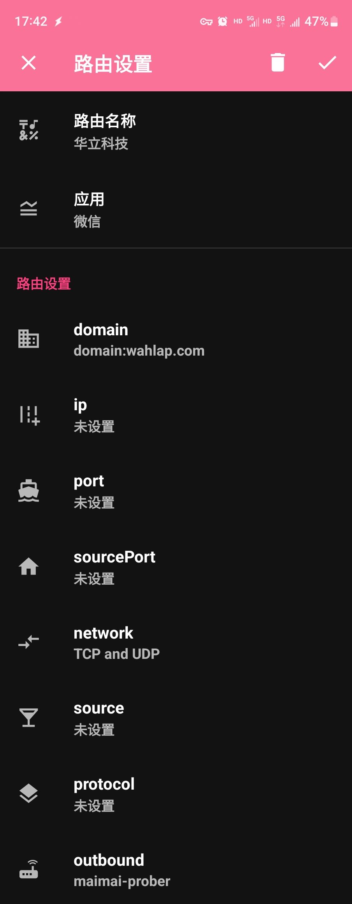

在 outbound 选项, 点击 选择配置 - maimai-prober (没有创建名字默认显示maimai.bakapiano.com:2560)

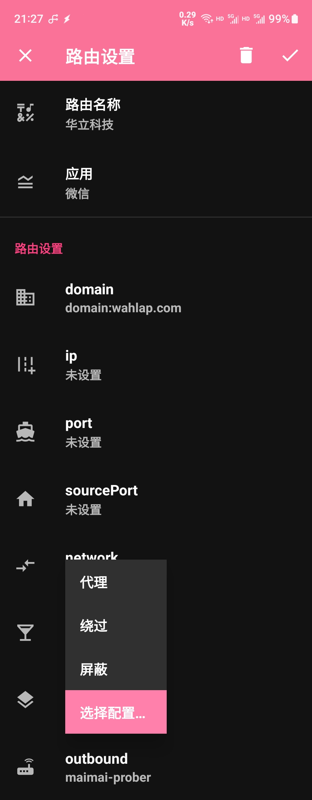

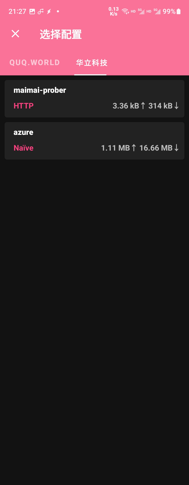

然后点击确认

在路由页面, 长按 华立科技 后, 拉倒最上面

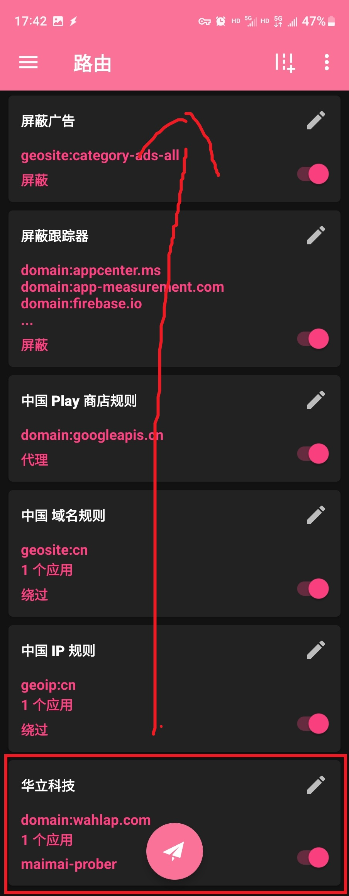

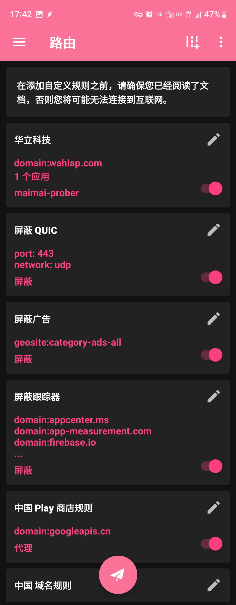

接着把所有路由规则, 都开启

### 上传成绩

在微信任意聊天中发送链接 https://maimai.bakapiano.com 并访问

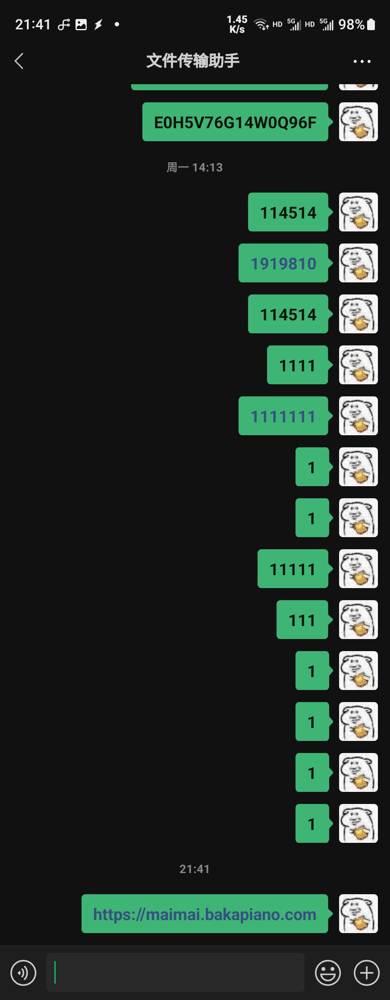

如果提示代理正常就可以提交成绩, 如下图

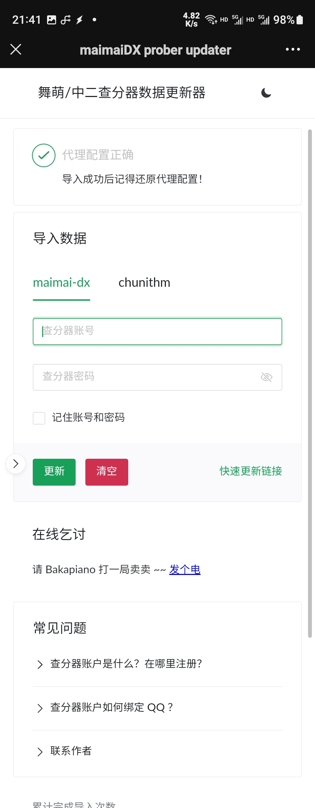

提交成绩页面

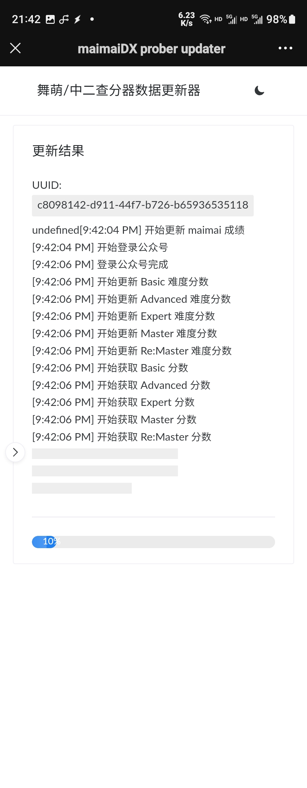

然后就可以查找成绩
